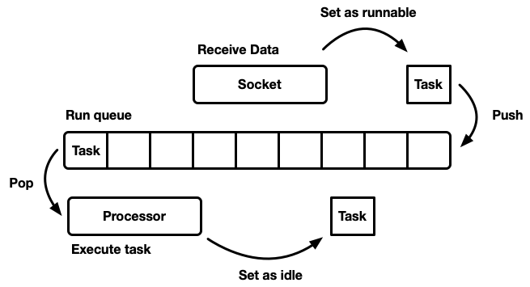
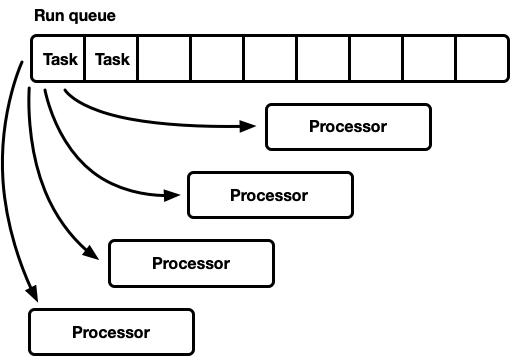
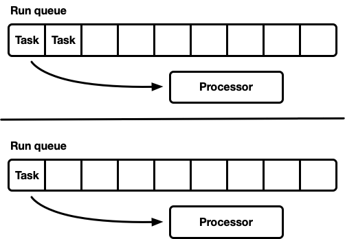
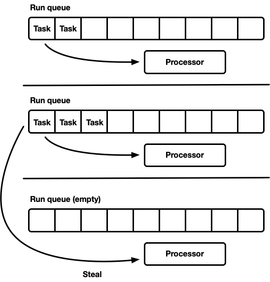

对于Rust异步编程来讲，一定会涉及到[tokio](https://github.com/tokio-rs/tokio)库，实现了Rust异步运行时。主要由以下几部分组成：
- 实现了一个基于work-stealing的多线程任务调度器
- 基于（epoll, kqueueu, IOCP, etc...）的Reactor
- 异步TCP，UDP Socket

>因为tokio库版本变化的比较快，目前学习是基于v0.2.20版本，以后还可能会发生变化， v0.1版本和v0.2版本的差别比较大，调度器部分有巨大提示，可参考[Making the Tokio scheduler 10x faster](https://tokio.rs/blog/2019-10-scheduler/)。

我们重点学习一下tokio调度器的实现。

### 调度器是如何工作的
调度器，就是实现如何调度程序执行。但这里的调度，只是我们上层自己实现的“用户空间”的调度器，并不是操作系统的内核调度器，如果你在之前接触过协程，会很容易理解。在之前有讲到，异步编程时我们可以将一个`Future`封装为一个任务`Task`，然后交给调度器调度执行。当然，真正工作的时候，会有大量的任务等待去调度执行，但具体怎么调度才能正确高效呢？

我们先别想最高效的调度器，我们先看一个最简单的调度器是如何实现的。本质上，可以将调度器抽象得看作是一个任务队列，然后不断的从任务队列中取任务执行。伪代码如下所示：
```rust
while let Some(task) = self.queue.pop() {
    task.run();
}
```

当任务可运行时，就Push到任务队列中，然后调度器会从任务队列中取出任务在处理器上执行。这种模式的调度器可以设计成单线程实现，但当前计算机都具备多个CPU，单线程调度器显然是低效的。为了充分利用CPU资源，我们想设计成多线程调度器，有以下两种方式：
- 一个全局任务队列，多个处理器
- 多个处理器，每个处理器都有自己的队列

**单任务队列，多处理器**        
这种模型，只有一个全局任务队列，当任务可运行时，放到队列尾部，处理器在不同的线程上运行，每个处理器都从队列头取任务执行。

这个任务队列必须支持多个生产者和多个消费者，通常的实现算法是侵入式链表。

**多任务队列，多处理器**        
这种模型中，每个处理器都有自己的任务队列。这样避免了同步的问题，但容易造成各处理器的负载不均衡，使资源利用率降低。


**work-stealing调度器**     
主要是为了解决上面多任务队列负载不均衡的问题。当当前处理器的任务队列为空时，就看看能否从其他任务队列窃取一部分任务调度执行。



**tokio调度器**
tokio调度器较为复杂一些。未完，待续......


---
>参考文档：      
- [Making the Tokio scheduler 10x faster](https://tokio.rs/blog/2019-10-scheduler/)
- [新版 Tokio 如何提升 10 倍性能详解](https://www.chainnews.com/articles/600754190318.htm#)